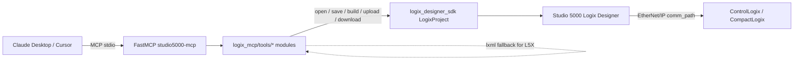

# studio5000-mcp

`studio5000-mcp` is a [FastMCP](https://github.com/jlowin/fastmcp) server that exposes the full Rockwell **Logix Designer SDK 2.0.1** surface to Claude Desktop and Cursor. It lets a model open `.ACD` / `.L5X` projects, list and edit tags, search rungs, build, convert between revisions, manage safety signatures, drive a connected ControlLogix / CompactLogix over EtherNet/IP, and stage SD-card images — all behind safe defaults (preflight validation, structured `[FAIL]` blocks, and a `confirm=true` gate on every controller-mutating call).

## Quickstart (Windows)

1. Install Python 3.12.x and Studio 5000 Logix Designer.
2. Run `install.bat` from this repo root.
3. Start the MCP server with `py -3.12 l5x_acd_server.py`.
4. Add an MCP config entry (example in [`claude_config.example.json`](claude_config.example.json)).
5. Validate setup with [`docs/TROUBLESHOOTING.md`](docs/TROUBLESHOOTING.md) and [`docs/EXAMPLES.md`](docs/EXAMPLES.md).

## Requirements

- **Python 3.12.x** — Rockwell's wheel (`logix_designer_sdk-2.0.1`) is pinned to `>=3.12,<3.13`. Python 3.13 will not install it.
- **Studio 5000 Logix Designer** installed on the same machine (the SDK shells into the installed Logix Services for builds, conversions, online ops, etc.).
- **The Rockwell wheel.** [`install.bat`](install.bat) installs it from the local Studio 5000 SDK Python folder, then pins the rest of the dependencies from [`requirements.txt`](requirements.txt):
  - `fastmcp>=3.0`
  - `mcp>=1.0`
  - `lxml>=5.0`

## Install + run

From this directory, in a Windows shell:

```bat
install.bat
```

That runs the equivalent of:

```bat
py -3.12 -m pip install "C:\Users\Public\Documents\Studio 5000\Logix Designer SDK\python\logix_designer_sdk-2.0.1-py3-none-any.whl"
py -3.12 -m pip install -r requirements.txt
```

Launch the server over stdio:

```bat
py -3.12 l5x_acd_server.py
```

`l5x_acd_server.py` is a tiny shim that calls `logix_mcp.server.main()` so existing Claude Desktop / Cursor configs keep working.

### Claude Desktop / Cursor MCP config

Add a server entry pointing at the absolute path to `l5x_acd_server.py`. Claude Desktop launches MCP servers with `cwd=System32`, so always use absolute paths.

```json
{
  "mcpServers": {
    "studio5000-mcp": {
      "command": "py",
      "args": ["-3.12", "C:\\path\\to\\studio5000-mcp\\l5x_acd_server.py"],
      "env": {
        "LOGIX_MCP_ROOT": "C:\\path\\to\\projects"
      }
    }
  }
}
```

Cursor's MCP settings use the same shape. `LOGIX_MCP_ROOT` is optional; when set, the `logix://projects/list` resource scans that directory for `*.ACD` / `*.L5X` files instead of the process working directory.

## Architecture

The server lives in the `logix_mcp/` package:

```
logix_mcp/
  __init__.py
  server.py            # FastMCP entrypoint, eagerly imports tools/* for side-effect registration
  _common.py           # mcp instance, error handler (_run/_fmt_err/_hint_for),
                       # preflight_* validators, MCPEventLogger, SDK-gating helpers
  _xml.py              # lxml helpers (_l5x_tree_for_path, _tag_rows, _routine_rows,
                       # _search_rungs, _l5x_quick_open_summary, _fmt_table)
  tools/
    __init__.py
    project_io.py      # open / save / export / read / convert / create_new / get_processor_types
    build.py           # build_project (default | physical | echo) + validate_project alias
    tags.py            # list_tags, get_tag, set_tag, update_tag
    program.py         # list_routines, search_rungs, get_all_executables (gated)
    partial.py         # export_component_l5x, import_partial_l5x,
                       # import_with_target_l5x, import_rungs_from_l5x,
                       # create_udt, create_tag, create_program, create_routine,
                       # add_io_module
    online.py          # get/set comm path, go_online/offline, read_connected_state,
                       # read/change controller mode, change_controller_type,
                       # upload_project / upload_to_new_project / download_project
    protection.py      # 11 gated lock/unlock/protect tools (per-component + *_all)
    safety.py          # is_safety_locked, safety_lock/unlock, set_*_password,
                       # generate/delete/get_safety_signature, get_safety_network_number
    sd_card.py         # store_image_on_sd_card, load_image_from_sd_card, deploy_to_sd_card
    resources.py       # logix://projects/list, logix://sdk/info
```

`logix_mcp/_common.py` owns the singleton `mcp = FastMCP("studio5000-mcp")` instance so every per-area tool module registers against the same registry. `logix_mcp/server.py` eagerly imports each `tools/*` module for the `@mcp.tool()` / `@mcp.resource()` side effects, then exposes `main()` to launch stdio transport.

## Repository docs

- [CONTRIBUTING.md](CONTRIBUTING.md) - contributor setup and workflow.
- [SECURITY.md](SECURITY.md) - security and safe operation guidance.
- [CHANGELOG.md](CHANGELOG.md) - project change history.
- [docs/DEVELOPMENT.md](docs/DEVELOPMENT.md) - internal development patterns.
- [docs/TROUBLESHOOTING.md](docs/TROUBLESHOOTING.md) - common failure modes and fixes.
- [docs/EXAMPLES.md](docs/EXAMPLES.md) - concise workflow examples.



## Tool catalog

Badge legend (plain text — clients render them as labels in tool docs):

- `[ONLINE]` — needs a live `comm_path` to a controller.
- `[DESTRUCTIVE]` — refuses to run unless called with `confirm=true`.
- `[GATED]` — the underlying SDK method ships in newer Rockwell wheels; on the pinned 2.0.1 the tool returns a friendly "not available in the installed logix_designer_sdk (2.0.1)" message and lights up automatically once the SDK is upgraded.

### Project I/O

| Tool | Description | Online? | Destructive? | SDK-gated? |
|------|-------------|---------|--------------|------------|
| `open_project` | Open a Logix project. `.L5X` defaults to a fast lxml peek; pass `sdk_open=true` for a full SDK open. `.ACD` always uses the SDK. | no | no | no |
| `save_project` | Save the project. With no `output` calls `save()`; otherwise `save_as` (toggles `detailed_l5x` for `.L5X`). | no | no | no |
| `export_l5x` | Export the full project to an `.L5X` via `save_as(detailed_l5x=true)`. | no | no | no |
| `read_l5x` | lxml-only summary of an `.L5X` file without opening it in the SDK. | no | no | no |
| `convert_project` | Convert between `.ACD` / `.L5X` / `.L5K` for a target major revision via `LogixProject.convert` + `save_as`. | no | no | no |
| `create_new_project` | Create a new `.ACD` for a processor type at a given major revision via `LogixProject.create_new_project`. | no | no | no |
| `get_processor_types` | List processor types `LogixProject.get_processor_types(major_revision)` reports for the installed Studio version. | no | no | no |

### Build

| Tool | Description | Online? | Destructive? | SDK-gated? |
|------|-------------|---------|--------------|------------|
| `build_project` | Build the project against `default` / `physical` / `echo` (maps to `RequestedBuildTarget`). | no | no | no |
| `validate_project` | Backwards-compatible alias for `build_project(path, "default")`. | no | no | no |

### Tags

| Tool | Description | Online? | Destructive? | SDK-gated? |
|------|-------------|---------|--------------|------------|
| `list_tags` | List Controller tags via a temporary detailed L5X export parsed with lxml. | no | no | no |
| `get_tag` | Read a typed tag value via `get_tag_value_<dt>` in `mode='offline'` (default) or `mode='online'`. | no | no | no |
| `set_tag` | Set a Controller tag offline via `set_tag_value[_<dt>]` and save. | no | no | no |
| `update_tag` | Alias for `set_tag` — preserves the original tool name from earlier releases. | no | no | no |

### Program structure

| Tool | Description | Online? | Destructive? | SDK-gated? |
|------|-------------|---------|--------------|------------|
| `list_routines` | List Programs / Routines / rung counts via a temp detailed L5X export. | no | no | no |
| `search_rungs` | Case-insensitive search over rung text + comments using a temp L5X. | no | no | no |
| `get_all_executables` | List every executable element (programs, routines, AOIs); SDK-gated, needs a newer wheel. | no | no | yes |

### Partial import / export

| Tool | Description | Online? | Destructive? | SDK-gated? |
|------|-------------|---------|--------------|------------|
| `export_component_l5x` | Export the component at `x_path` to an `.L5X` via `partial_export_to_xml_file` (use `force=true` to overwrite). | no | no | no |
| `import_partial_l5x` | Merge an L5X fragment at `x_path` via `partial_import_from_xml_file`; `collision in {overwrite, discard, cancel}`. | no | no | no |
| `import_with_target_l5x` | Single-target partial import / rename via `partial_import_with_target_from_xml_file`; `pending_edits in {leave, accept, finalize}`. | no | no | no |
| `import_rungs_from_l5x` | Insert / replace rungs in a routine via `partial_import_rungs_from_xml_file`. | no | no | no |
| `create_udt` | Create one UDT by generating an L5X DataType fragment and importing it under `Controller/DataTypes`; accepts `members_json` (JSON list with member `name` + `data_type`, optional `dimension`, `radix`, `hidden`, `external_access`, `description`). Optional `software_revision` overrides fragment revision. | no | no | no |
| `create_tag` | Create one controller-scope Tag by generating an L5X Tag fragment and importing it under `Controller/Tags` (`tag_name`, `data_type`, optional `initial_value`, `radix`, `external_access`, `description`). | no | no | no |
| `create_program` | Create one Program (with a starter RLL main routine) by generating an L5X Program fragment and importing it under `Controller/Programs`. | no | no | no |
| `create_routine` | Create one Routine under an existing Program by generating an L5X Routine fragment and importing it under `Controller/Programs/Program[@Name='...']/Routines` (`routine_type` currently supports `RLL`; optional `initial_rll_text`). | no | no | no |
| `add_io_module` | Add/configure I/O modules by importing a module-focused L5X fragment under `Controller/Modules` (file path or inline XML). | no | no | no |

### Online with controller `[ONLINE]`

| Tool | Description | Online? | Destructive? | SDK-gated? |
|------|-------------|---------|--------------|------------|
| `get_communications_path` | Return the project's currently-configured communications path. | yes | no | no |
| `set_communications_path` | Set the project's communications path and save (in-place or to `output`). | yes | no | no |
| `go_online` | Set comm path and bring the project online with the controller. | yes | yes | no |
| `go_offline` | Take the project offline from the attached controller. | yes | yes | no |
| `read_connected_state` | Return the controller's connected state (`ONLINE`, `OFFLINE`, ...). | yes | no | no |
| `read_controller_mode` | Return the controller's current mode (`PROGRAM`, `RUN`, `TEST`, ...). | yes | no | no |
| `change_controller_mode` | Change the controller's mode to `program` / `run` / `test`. | yes | yes | no |
| `change_controller_type` | Morph the project to a new processor type and `save_as` the result. | yes | yes | no |
| `upload_project` | Upload the running controller's program into the project and save (streams progress via `MCPEventLogger`). | yes | yes | no |
| `upload_to_new_project` | Upload the controller's program into a brand-new `.ACD` at `new_path`. | yes | yes | no |
| `download_project` | Download the project into the controller (must be in PROGRAM mode unless `ensure_program_mode=false`). | yes | yes | no |

### Protection `[GATED]`

All tools below are gated on the installed SDK; on `logix_designer_sdk 2.0.1` they return `Tool '<name>' is not available in the installed logix_designer_sdk (2.0.1). Upgrade Logix Designer SDK to use it.`

| Tool | Description | Online? | Destructive? | SDK-gated? |
|------|-------------|---------|--------------|------------|
| `is_executable_locked` | Return whether the routine / AOI at `x_path` is currently locked. | no | no | yes |
| `lock_executable` | Lock the (already license-protected) routine / AOI at `x_path`. | no | yes | yes |
| `unlock_executable` | Unlock the routine / AOI at `x_path`. | no | yes | yes |
| `is_executable_protected` | Return whether the routine / AOI at `x_path` is currently protected. | no | no | yes |
| `protect_with_password` | Protect the routine / AOI at `x_path` with a password. | no | yes | yes |
| `protect_with_license` | Protect the routine / AOI at `x_path` with a firm / product license. | no | yes | yes |
| `unprotect` | Remove protection from the routine / AOI at `x_path`. | no | yes | yes |
| `lock_all` | Lock every (license-protected) routine and AOI in the project. | no | yes | yes |
| `unprotect_all` | Remove protection from every routine and AOI in the project. | no | yes | yes |
| `protect_all_with_password` | Protect every routine and AOI in the project with a password. | no | yes | yes |
| `protect_all_with_license` | Protect every routine and AOI in the project with a firm / product license. | no | yes | yes |

### Safety (GuardLogix)

| Tool | Description | Online? | Destructive? | SDK-gated? |
|------|-------------|---------|--------------|------------|
| `is_safety_locked` | Return whether the safety task in the project is currently locked. | no | no | no |
| `safety_lock` | Apply a safety lock to the project using `password`. | no | yes | no |
| `safety_unlock` | Remove the project's safety lock using `password`. | no | yes | no |
| `set_safety_lock_password` | Set / change / erase the safety **lock** password (pass `new_password=""` to erase). | no | yes | no |
| `set_safety_unlock_password` | Set / change / erase the safety **unlock** password (pass `new_password=""` to erase). | no | yes | no |
| `generate_safety_signature` | Generate a fresh safety signature on the online controller (sets comm path, downloads, goes online, then signs). | yes | yes | no |
| `delete_safety_signature` | Delete the safety signature from the online controller (same online sequence). | yes | yes | no |
| `get_safety_signature` | Return the project's current safety signature (or empty if none). | no | no | no |
| `get_safety_network_number` | Return the safety network number of `module_name` (default `Local`). | no | no | no |

### SD card

| Tool | Description | Online? | Destructive? | SDK-gated? |
|------|-------------|---------|--------------|------------|
| `store_image_on_sd_card` | Download the project and store the running image on the controller's SD card; supports both basic and advanced (`load_event` / `load_mode` / `afu` / `image_name` / `image_note`) forms. | yes | yes | no |
| `load_image_from_sd_card` | Load the previously-stored SD-card image back into the controller. | yes | yes | no |
| `deploy_to_sd_card` | Convenience: download the project to the controller, then store the image on its SD card in one call. | yes | yes | no |

## MCP resources

- **`logix://projects/list`** — lists `*.ACD` and `*.L5X` files (with size in MB) under `LOGIX_MCP_ROOT` (or the process cwd if unset). Capped at 200 entries.
- **`logix://sdk/info`** — reports the running Python version, the installed `logix_designer_sdk` version, and every public callable on `LogixProject` grouped by area (Project I/O, Online, Build, Tags, Program, Partial, Protection, Safety, SD card, Events, Other). Use this from the model side to confirm which `[GATED]` tools are live on a given install.

## Discovering legal parameter values

Two tools eliminate guesswork about what strings to pass:

- **`list_options(parameter="")`** — enumerates every closed-set string parameter the server validates: `target`, `controller_mode`, `mode` (tag op-mode), `data_type`, `collision`, `pending_edits`, `load_event`, `load_mode`, `afu`. Call with no argument at the start of a session to dump them all, or pass a specific parameter name (e.g. `list_options(parameter="data_type")`) to get just that entry. For `processor_type` (an open set determined by what Studio 5000 has installed) the entry points you at `get_processor_types` below.
- **`get_processor_types(major_revision)`** — calls `LogixProject.get_processor_types(major_revision)` and returns a `Name | ProductCode | ProductType | Id` table. The `Name` column is what you pass to `create_new_project` or `change_controller_type` as `processor_type` (e.g. `"1756-L85E"`, `"5069-L320ERMS3"`). An empty result means that major revision isn't installed on the host.

## Error handling

Every tool body runs inside the layered error handler in `logix_mcp/_common.py`. On failure the tool returns a deterministic block clients can parse:

```text
[FAIL] <action>
code:    <STABLE_TOKEN>
class:   <PythonExceptionClassName>
message: <SDK or stdlib message verbatim>
hint:    <classified hint or generic suggestion>
context: key1=value1 key2=value2 ...
```

The exception cascade (top to bottom) is:

```
asyncio.CancelledError       # always re-raised — never swallowed
OperationFailedError         # OPERATION_FAILED
OperationNotPerformedError   # NOT_PERFORMED
LoggerFailedError            # LOGGER_FAILED
ProjectError                 # PROJECT_ERROR
LogixSdkError                # SDK_ERROR
FileNotFoundError            # FILE_NOT_FOUND
PermissionError              # PERMISSION_DENIED
OSError                      # OS_ERROR
ValueError                   # INVALID_INPUT
```

Preflight validators (`preflight_project_path`, `preflight_output_path`, `preflight_comm_path`, `preflight_xpath`, `preflight_build_target`, `preflight_controller_mode`, `preflight_data_type`, `preflight_confirm`) emit `[FAIL]` blocks with the appropriate `code` (`INVALID_INPUT`, `FILE_NOT_FOUND`, `PERMISSION_DENIED`, `CONFIRM_REQUIRED`) before any SDK call is made, so bad input never reaches Studio.

`_hint_for(message)` matches documented Rockwell tokens against the SDK message and returns an actionable fix. Tokens currently classified:

- `RxE_DATA_TOO_NEW` — project was created with a newer Logix Designer; install / morph from a machine that has it.
- `Required Logix Designer version: ##.# is not installed` — install that exact major revision.
- `Minimum supported revision is 31` — `convert_project` only supports targets >= 31.
- `Not supported processor type` — pass a name from `get_processor_types`.
- `RxCsE_MORPH_TO_THIS_CONTROLLER_NOT_SUPPORTED` — morph between these controller families isn't allowed (e.g. ICE2 → ICE1).
- `XMLSrv_E_IMPORT_ABORTED_NO_CHANGES` — generated fragment was rejected; export a known-good object from the destination project and diff structure/attributes.
- `XMLSrv_E_INCOMPATIBLE_IMPORT_TARGET` — fragment root does not match the `x_path` target type.
- `XMLSrv_E_TARGET_NOT_FOUND` — import target object/path does not exist in destination.
- Plus heuristic matches for `controller mode`, `locked`, `Access is denied`, `XPath`, `communication path`, `signature`, etc.

Example output (from a `download_project` call without `confirm=true`):

```text
[FAIL] download the local project into the controller (overwrites running program)
code:    CONFIRM_REQUIRED
class:   ValueError
message: destructive online operation requires explicit opt-in
hint:    Re-run with confirm=true to actually mutate the controller. This call will download the local project into the controller (overwrites running program).
context: confirm=False
```

## Confirm gate

Every controller-mutating tool — `go_online`, `go_offline`, `change_controller_mode`, `change_controller_type`, `upload_project`, `upload_to_new_project`, `download_project`, every protection mutation, `safety_lock`, `safety_unlock`, the safety password setters, `generate_safety_signature`, `delete_safety_signature`, `store_image_on_sd_card`, `load_image_from_sd_card`, `deploy_to_sd_card` — requires the caller to pass `confirm=true`. Without it the tool returns a `[FAIL]` block with `code: CONFIRM_REQUIRED` and never opens Studio. Read-only inspection tools (`get_communications_path`, `read_connected_state`, `read_controller_mode`, `is_safety_locked`, `get_safety_signature`, etc.) and offline manipulators (`open_project`, `list_tags`, `set_tag`, `build_project`, partial import / export, etc.) do not need it.

## Communications path format

Use the RSWho-style backslash-separated path. Example:

```text
AB_ETH-1\10.88.45.25\Backplane\0
```

`preflight_comm_path` accepts any non-empty string that contains backslashes plus either a dotted-quad IP segment or the literal `Backplane` keyword.

## Example workflows

Each block shows a tool sequence Claude or Cursor would chain end-to-end. Argument names match the actual tool signatures.

**1. Upload the running program into a new project, then explore it.**

```text
upload_to_new_project(new_path=r"C:\projects\plant_4.ACD",
                      comm_path=r"AB_ETH-1\10.88.45.25\Backplane\0",
                      confirm=true)
list_routines(path=r"C:\projects\plant_4.ACD")
search_rungs(path=r"C:\projects\plant_4.ACD", text="EmergencyStop")
```

**2. Patch a routine offline, validate the build, push it back to the controller.**

```text
import_rungs_from_l5x(path=r"C:\projects\plant_4.ACD",
                      routine_x_path="Controller/Programs/Program[@Name='MainProgram']/Routines/Routine[@Name='MainRoutine']",
                      insert_position=0, replace_count=0,
                      l5x_path=r"C:\patches\new_rungs.L5X",
                      pending_edits="accept")
build_project(path=r"C:\projects\plant_4.ACD", target="default")
download_project(path=r"C:\projects\plant_4.ACD",
                 comm_path=r"AB_ETH-1\10.88.45.25\Backplane\0",
                 ensure_program_mode=true,
                 confirm=true)
```

**3. Convert a 2017-era L5X export up to a current ACD and open it.**

```text
convert_project(path=r"C:\archive\old_project.L5X",
                major_revision=37,
                output=r"C:\projects\old_project_v37.ACD")
open_project(path=r"C:\projects\old_project_v37.ACD")
```

## Known limitations

- **Protection / `get_all_executables` are gated.** The pinned `logix_designer_sdk 2.0.1` wheel does not expose those API methods. The tools are still announced to MCP clients, but every call returns `Tool '<name>' is not available in the installed logix_designer_sdk (2.0.1). Upgrade Logix Designer SDK to use it.` until a newer wheel is installed — the gating helper auto-detects the new methods, no code change required.
- **Long operations stream progress, not timeout.** Builds, uploads, downloads, and SD-card operations can take many minutes on large ACDs. The server passes an `MCPEventLogger` to those calls so the SDK's progress / status / error callbacks are forwarded through Python `logging` to the MCP host (Claude Desktop / Cursor see the stderr stream). The server intentionally does **not** impose its own timeouts — the MCP client owns that policy.
- **Multi-controller orchestration is the model's job.** There's no single "download to N controllers" tool; loop `download_project` (or `deploy_to_sd_card`) per controller from the calling agent. This matches the multi-controller patterns shipped in the SDK Examples folder.
- **Safety considerations.** This server can mutate Logix projects on disk and the running program in attached controllers. Only enable it for trusted MCP clients and trusted operators.
- **Example project files may contain creator metadata.** Real-world `.L5X` / `.ACD` exports can include usernames, machine names, and timestamps; scrub before publishing proprietary project data.
